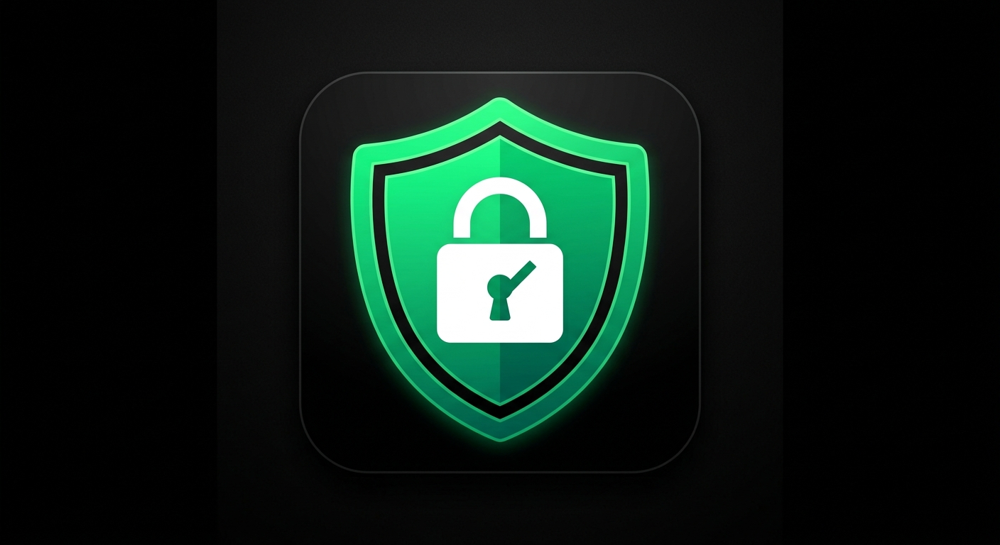

# DNS Shield



DNS Shield 是一款 Android DNS 防護工具，透過系統 `VpnService` 將標準 IPv4 UDP DNS 查詢導向本機處理，再依規則阻擋或轉送至使用者選擇的 DNS 解析服務。App 不需要 Root，也不會代理一般網頁、影音或即時通訊流量。

## 功能

- 使用 Android `VpnService` 建立僅涵蓋指定 DNS 位址的本機介面。
- 內建 Google DNS、Cloudflare DNS、AdGuard DNS 與 Quad9 預設值。
- 可為每組解析器選擇「加密優先，允許 UDP/53 降級」或「僅加密」；舊設定升級後保留原本的明文降級行為。
- 支援自訂 HTTPS DoH 主要與備援端點；自訂主機名稱使用明確的 bootstrap IPv4 位址，並保留 HTTPS 憑證及 hostname 驗證。
- 依內建規則與 APK 內固定版本的 1Hosts Lite compiled blocklist，以 NXDOMAIN 回覆廣告、追蹤及惡意網域。
- 阻擋規則已由可單元測試的 `DomainMatcher` 元件處理，並保留既有的決策快取與 VPN DNS 熱路徑行為。
- APK 內的 `active.bin` 含 102,972 筆固定來源規則；若 App 私有 `blocklists/active.bin` 存在，則作為本機 override。parent-domain matching 受 APK 內已驗證的 Public Suffix List 邊界限制。
- 控制中心會顯示目前規則來源、revision、日期、筆數、驗證狀態，以及 Public Suffix List 是否降級為精確網域比對。
- 支援自訂 DNS、DNS 回應快取及同時重複查詢去重。
- 明文降級模式遇到上游 UDP 截短回應時，會在原請求期限內以 TCP/53 重試；TUN MTU 設為 1500 bytes，送回用戶端的 DNS payload 上限為 min(EDNS/512 bytes, MTU−28 bytes = 1472 bytes)，超出時只保留完整資源記錄、設定 TC 並更新 section counts。
- 支援選擇具有啟動入口的已安裝 App，使其略過 DNS Shield VPN。
- 在 App 開啟時顯示查詢數、阻擋數、估算節省流量與診斷日誌。

## 能力邊界

DNS Shield 是 DNS 層工具，不是完整流量 VPN、防毒軟體或防火牆：

- 目前只處理由系統 VPN DNS 路徑送入的 IPv4 UDP/53 查詢；DNS/TCP 僅用於上游 UDP 截短後的明文重試，客戶端送入 VPN 的 DNS/TCP 尚未支援，需待 D11。
- App 自行使用 DoH、DoT、非標準連接埠、直接 IP 連線或其他繞過系統 DNS 的方式，不會被此工具攔截。
- DNS 層規則無法阻擋與正常內容共用網域的廣告，也無法保證涵蓋所有廣告、追蹤或惡意網域。
- App 不會在執行期間下載遠端規則；production blocklist 只會隨經驗證的新 APK 更新。私有 override 缺失時使用 APK 內規則，格式或排序驗證失敗時也會改用 APK 內已驗證的清單；若該清單同樣無法使用，才退回內建規則。
- 「節省流量」是依被阻擋網域類型推算的參考值，不是實際網路流量量測。
- 實際解析延遲、耗電與攔截效果會因裝置、Android 版本、網路及 DNS 解析器而異。

## 隱私

DNS Shield 不包含帳號、分析 SDK、廣告 SDK或開發者營運的後端服務。DNS 查詢會傳送至使用者選擇的第三方解析器；已安裝 App 清單、排除名單與設定不會由 DNS Shield 上傳。

DoH 將 DNS 查詢包在 HTTPS 傳輸中，但 DNS Shield 不會在本機驗證 DNSSEC。選擇「僅加密」時，DoH 端點故障、退避或自訂 bootstrap 不可用都會回覆 SERVFAIL，且不會降級為 UDP/53 或 TCP/53；「加密優先」會在加密端點失敗時使用未加密 UDP/53，若 UDP 回應設有 TC，則在原請求期限內改用 TCP/53 重試。自訂 DoH hostname 的 bootstrap 只使用設定的數字 IP，不會再透過系統 DNS 查詢該 hostname。

完整資料處理方式請參閱 [PRIVACY.md](PRIVACY.md)。

## 權限用途

| 權限 | 用途 |
| --- | --- |
| `INTERNET` | 將允許的 DNS 查詢送往選定解析器。 |
| `FOREGROUND_SERVICE` | 在 VPN 啟用期間維持可見的前景服務通知。 |
| `FOREGROUND_SERVICE_SYSTEM_EXEMPTED` | Android 14 以上執行持續作用中的 VPN 前景服務。 |
| `POST_NOTIFICATIONS` | 顯示 VPN 運作中的前景服務通知。 |
| `QUERY_ALL_PACKAGES` | 查詢具有啟動入口的已安裝 App，讓使用者建立 VPN 排除名單。資料只在裝置上使用。 |
| `BIND_VPN_SERVICE` | 由 Android 系統綁定及管理 `VpnService`；此權限只套用於服務元件。 |

`QUERY_ALL_PACKAGES` 提供廣泛的套件可見性，只用於使用者主動開啟的 App 排除功能。

## 安裝

1. 從 GitHub Releases 下載正式簽名的 APK。
2. 安裝並開啟 DNS Shield。
3. 按下主畫面的防護按鈕。
4. 首次使用時接受 Android 顯示的 VPN 連線授權。

從 GitHub 安裝新版時，APK 必須使用與舊版相同的簽名金鑰，Android 才能直接升級。

## 開發建置

需求：Python 3、Android Studio JBR、Android SDK，以及可執行的 Gradle Wrapper。

```powershell
powershell -NoProfile -ExecutionPolicy Bypass -File .\verify.ps1
```

驗證入口會執行離線 Python 工具測試、production Public Suffix 與 active blocklist asset 驗證、Android lint、Debug APK 與 androidTest APK 建置、JVM 單元測試及 Kotlin 編譯。GitHub Actions 固定使用 Windows 2025、Python 3.13.15 與 Temurin 17.0.20+8 執行同一個 `verify.ps1`，並保存 JVM 測試與 lint 報告。

目前 `main` 已將 GitHub Actions 的 `Windows verification` 設為 required status check，並套用於 repository 管理員；分支不必先與 `main` 同步。D01–D12 專屬回歸案例會隨各功能修復加入；要等功能 PR 在此 workflow 下實際通過後，才能確認全部涵蓋。

`assembleDebugAndroidTest` 只建置 instrumentation APK，不代表已執行 instrumentation tests。連接 emulator 或 Android 裝置後，可用以下命令執行；公開 DNS 測試與實機效能、耗電量測仍須明確啟動：

```powershell
.\gradlew.bat --no-daemon --console=plain :app:connectedDebugAndroidTest
```

離線 blocklist 編譯器及其測試可獨立執行：

```powershell
python -m unittest discover tools/tests
python tools/build_blocklist.py --input tools/tests/fixtures/blocklist.txt --output build/test-blocklist.bin
```

production `active.bin` 使用固定 commit 與 SHA-256 的 1Hosts Lite 來源；準備腳本是明確、opt-in 的維護操作，日常 App 執行不會下載規則：

```powershell
powershell -NoProfile -ExecutionPolicy Bypass -File .\prepare-active-blocklist-production.ps1
powershell -NoProfile -ExecutionPolicy Bypass -File .\install-active-blocklist-asset.ps1
```

二進位格式、來源合約與更新方式請參閱 [docs/blocklist-format.md](docs/blocklist-format.md)。第三方資料歸屬請參閱 [THIRD_PARTY_NOTICES.md](THIRD_PARTY_NOTICES.md)。

連接 adb 實機後，可比較內建規則與 production blocklist 的組裝及 lookup 成本：

```powershell
powershell -NoProfile -ExecutionPolicy Bypass -File .\benchmark-production-blocklist-android.ps1
```

測試方法與 ASUS_Z01RD 實測結果請參閱 [docs/production-blocklist-android-benchmark.md](docs/production-blocklist-android-benchmark.md)。

Public Suffix 來源更新是獨立且明確的維護操作。先安裝鎖定且帶雜湊的 IDNA 依賴，再取得並正規化 manifest 指定的來源：

```powershell
python -m pip install --require-hashes -r tools/requirements-public-suffix.txt
python tools/prepare_public_suffix_source.py `
  --manifest tools/public_suffix_source.json `
  --output build/public-suffix.normalized.dat `
  --metadata-output build/public-suffix.source.json
python tools/build_public_suffix.py `
  --input build/public-suffix.normalized.dat `
  --output build/public-suffix.bin
```

準備器只接受 `publicsuffix.org` 的 pinned 來源，會驗證並移除官方 URL 加入的 `VERSION`/`COMMIT` 前導註解，再以指定 upstream Git blob 驗證其餘完整位元組；日常 `verify.ps1` 不會下載來源或安裝套件。格式與供應鏈邊界請參閱 [docs/public-suffix-format.md](docs/public-suffix-format.md)。

產生完整 normalized source 與 artifact 後，可用固定的 production manifest 驗證輸出並執行 opt-in JVM characterization：

```powershell
powershell -NoProfile -ExecutionPolicy Bypass -File .\benchmark-public-suffix.ps1
```

腳本會先確認來源 revision、IDNA 版本、SHA-256、檔案大小、規則數與 deterministic regeneration，再輸出 `build/public-suffix.validation.json` 與 `build/public-suffix.benchmark.json`。benchmark 記錄載入時間、估算常駐 heap 與 lookup latency，但不設定跨裝置的效能通過門檻，也不會由日常 `verify.ps1` 自動執行。

連接 adb 實機後，可使用同一份已驗證 artifact 執行測試 APK 專用的 instrumented characterization：

```powershell
powershell -NoProfile -ExecutionPolicy Bypass -File .\benchmark-public-suffix-android.ps1
```

腳本只把 benchmark artifact 複製到 `app/build/generated` 的 androidTest asset；結果會拉回 `build/public-suffix.android-benchmark.json`。Production APK 另包含已釘選且驗證的 PSL asset，只有有效 `active.bin` 需要 parent-domain matching 時才由 service lifecycle lazy 載入；載入失敗時 compiled blocklist 退回 exact-only。測試流程與指標解讀請參閱 [docs/public-suffix-android-benchmark.md](docs/public-suffix-android-benchmark.md)。

## 正式發行

正式套件識別為 `io.github.xiangwang2000.dnsshield`。目前程式版本為 `1.2.2`、`versionCode 5`；不要變更 `applicationId`，每次發布新版都必須增加 `versionCode`。

第一次建立本機發行金鑰：

```powershell
powershell -NoProfile -ExecutionPolicy Bypass -File .\setup-release-signing.ps1
```

請將產生的 `release/dns-shield-upload.p12` 與 `keystore.properties` 安全備份；兩者都由 `.gitignore` 排除，不得提交至 GitHub。

建立並驗證正式簽名 APK：

```powershell
powershell -NoProfile -ExecutionPolicy Bypass -File .\release.ps1
```

腳本會產生 `app/build/outputs/apk/release/app-release.apk`、驗證 APK 簽名，並輸出 SHA-256 檔案供 GitHub Release 使用。CI 也可以改用 `KEYSTORE_PATH`、`STORE_PASSWORD`、`KEY_ALIAS`、`KEY_PASSWORD` 環境變數提供簽名資料。

## License

Copyright 2026 XiangWang2000

DNS Shield is licensed under the [Apache License 2.0](LICENSE).
