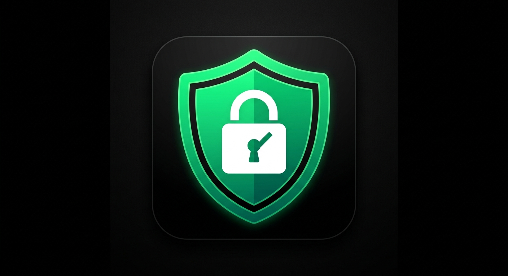

# DNS Shield



**你的 DNS，照你的規則走。**

Android DNS 防護工具，透過本機 VPN 比對網域規則，封鎖廣告、追蹤與惡意網域。支援 Android 7.0（API 24）以上，不需要 Root。

## 主要功能

- **網域防護**：內建固定版本的 1Hosts Lite 名單，可自行新增允許或封鎖規則。
- **自選 DNS**：提供 Google、Cloudflare、AdGuard、Quad9，也能設定自訂 DNS／DoH。
- **加密設定**：可選「加密優先，允許 UDP/53 降級」或「僅加密」；僅加密模式失敗時回覆解析錯誤，不會改用明文 DNS。
- **App 排除**：選擇要略過 DNS Shield VPN 的已安裝 App。
- **查詢紀錄**：查看查詢數、封鎖數與診斷日誌。

> 以上說明以目前原始碼為準；已發布 APK 的功能請看對應的 [Release](https://github.com/XiangWang2000/dns-shield/releases)。

## 安裝與使用

1. 從 [GitHub Releases](https://github.com/XiangWang2000/dns-shield/releases) 下載 APK 並安裝。
2. 開啟 DNS Shield，選擇 DNS 解析器及加密模式。
3. 按下主畫面的防護按鈕，首次使用時同意 Android 的 VPN 授權。
4. 確認 App 顯示防護已啟用，以及系統的 VPN 指示。

新版 APK 必須與舊版使用相同簽名，才能直接升級。

## 使用限制

- 只處理 IPv4 UDP／TCP 53 的 DNS 查詢。一般網頁、影音與 IPv6 流量走原本的網路；IPv6 DNS、App 自帶的 DoH／DoT 或直接 IP 連線不會被攔截。
- 無法靠網域規則擋住與正常內容共用網域的廣告。名單隨 APK 更新，App 不會自行下載遠端規則。
- 部分裝置的電池／背景限制會阻止 VPN 恢復。已測的 ASUS Android 10 裝置需要電池豁免；重開機後若顯示「防護已關閉」，請重新啟用並確認狀態。
- 可使用系統 Always-on；目前不宣稱支援「封鎖未透過 VPN 的連線」（lockdown）。

## 隱私

沒有帳號、分析 SDK、廣告 SDK 或開發者後端。設定、網域規則與 App 排除名單留在裝置上；DNS 查詢會送到你選擇的第三方解析器。DoH 以 HTTPS 傳輸查詢，App 不在本機驗證 DNSSEC。詳見 [隱私權說明](PRIVACY.md)。

## 開發

專案使用 Kotlin、Jetpack Compose、ViewModel／Room 與 OkHttp。VPN 和 DNS 處理在 `service/`，網域政策在 `blocking/`，TCP DNS 的原生橋接在 `app/src/main/cpp/`。

需要 Python 3、JDK 21、Android SDK 37 與 NDK `27.2.12479018`。完整架構、環境設定、裝置測試與發行步驟見 [技術與開發指南](docs/development.md)。

```powershell
git clone --recurse-submodules https://github.com/XiangWang2000/dns-shield.git
cd dns-shield
powershell -NoProfile -ExecutionPolicy Bypass -File .\verify.ps1
```

`verify.ps1` 是完整驗證入口；建置測試 APK 不代表已執行裝置測試。

## 文件與驗證進度

| 主題 | 文件 |
| --- | --- |
| DNS、規則、權限與完整開發流程 | [技術與開發指南](docs/development.md) |
| 整合與裝置驗收 | [共同驗收](docs/r09-common-validation.md)、[Wi-Fi／行動數據驗收](docs/r10-cellular-handoff-validation.md) |
| 第三方資料與授權 | [THIRD_PARTY_NOTICES.md](THIRD_PARTY_NOTICES.md) |
| 版本異動 | [CHANGELOG.md](CHANGELOG.md) |

IPv6-only／NAT64、真正 captive portal、完整 Android 版本／廠牌覆蓋與低記憶體終止程序（LMK）、8–10 小時拔除充電線的耗電 A/B 仍有未驗證項目，追蹤於 [#73](https://github.com/XiangWang2000/dns-shield/issues/73)。

## License

Copyright 2026 XiangWang2000

DNS Shield is licensed under the [Apache License 2.0](LICENSE).
